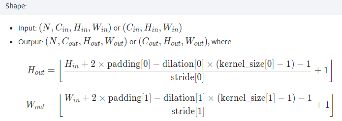
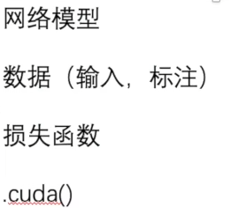

# 22_nn_sequential

仿照CIFAR 10 Model，构造神经网络模型。


如何确定卷积层padding参数




# 23_loss

损失函数，简言之，计算预测结果与实际标签之间的差异


# 25

UserWarning: The parameter 'pretrained' is deprecated since 0.13 and may be removed in the future, please use '**<u>weights</u>**' instead.
  warnings.warn

UserWarning: Arguments other than a weight enum or `None` for 'weights' are deprecated since 0.13 and may be removed in the future. The current behavior is equivalent to passing `weights=VGG16_Weights.IMAGENET1K_V1`. You can also use `weights=VGG16_Weights.DEFAULT` to get the most up-to-date weights.
  warnings.warn(msg)


VGG16 模型

```
VGG(
  (features): Sequential(
    (0): Conv2d(3, 64, kernel_size=(3, 3), stride=(1, 1), padding=(1, 1))
    (1): ReLU(inplace=True)
    (2): Conv2d(64, 64, kernel_size=(3, 3), stride=(1, 1), padding=(1, 1))
    (3): ReLU(inplace=True)
    (4): MaxPool2d(kernel_size=2, stride=2, padding=0, dilation=1, ceil_mode=False)
    (5): Conv2d(64, 128, kernel_size=(3, 3), stride=(1, 1), padding=(1, 1))
    (6): ReLU(inplace=True)
    (7): Conv2d(128, 128, kernel_size=(3, 3), stride=(1, 1), padding=(1, 1))
    (8): ReLU(inplace=True)
    (9): MaxPool2d(kernel_size=2, stride=2, padding=0, dilation=1, ceil_mode=False)
    (10): Conv2d(128, 256, kernel_size=(3, 3), stride=(1, 1), padding=(1, 1))
    (11): ReLU(inplace=True)
    (12): Conv2d(256, 256, kernel_size=(3, 3), stride=(1, 1), padding=(1, 1))
    (13): ReLU(inplace=True)
    (14): Conv2d(256, 256, kernel_size=(3, 3), stride=(1, 1), padding=(1, 1))
    (15): ReLU(inplace=True)
    (16): MaxPool2d(kernel_size=2, stride=2, padding=0, dilation=1, ceil_mode=False)
    (17): Conv2d(256, 512, kernel_size=(3, 3), stride=(1, 1), padding=(1, 1))
    (18): ReLU(inplace=True)
    (19): Conv2d(512, 512, kernel_size=(3, 3), stride=(1, 1), padding=(1, 1))
    (20): ReLU(inplace=True)
    (21): Conv2d(512, 512, kernel_size=(3, 3), stride=(1, 1), padding=(1, 1))
    (22): ReLU(inplace=True)
    (23): MaxPool2d(kernel_size=2, stride=2, padding=0, dilation=1, ceil_mode=False)
    (24): Conv2d(512, 512, kernel_size=(3, 3), stride=(1, 1), padding=(1, 1))
    (25): ReLU(inplace=True)
    (26): Conv2d(512, 512, kernel_size=(3, 3), stride=(1, 1), padding=(1, 1))
    (27): ReLU(inplace=True)
    (28): Conv2d(512, 512, kernel_size=(3, 3), stride=(1, 1), padding=(1, 1))
    (29): ReLU(inplace=True)
    (30): MaxPool2d(kernel_size=2, stride=2, padding=0, dilation=1, ceil_mode=False)
  )
  (avgpool): AdaptiveAvgPool2d(output_size=(7, 7))
  (classifier): Sequential(
    (0): Linear(in_features=25088, out_features=4096, bias=True)
    (1): ReLU(inplace=True)
    (2): Dropout(p=0.5, inplace=False)
    (3): Linear(in_features=4096, out_features=4096, bias=True)
    (4): ReLU(inplace=True)
    (5): Dropout(p=0.5, inplace=False)
    (6): Linear(in_features=4096, out_features=1000, bias=True)
  )
)
```


# 26_save_load

将模型（网络模型）保存，加载


1. 【方式1】直接保存模型结构+模型参数
   ```python
   torch.save(vgg16, "./model/vgg16_model1")
   
   model1 = torch.load("./model/vgg16_model1")
   ```

   
2. 【方式2】只保存模型参数（官方推荐）
   ```python
   torch.save(vgg16.state_dict(), "./model/vgg16_model2")
   
   model2 = torchvision.models.vgg16(weights=None)
   model2.load_state_dict(torch.load("./model/vgg16_model2"))
   ```

   

🔺注意，自己的模型使用方式2保存后。若要load，需要在load前将模型导入。


# 27 train

完整的模型训练过程


训练过程的基本流程

```python
# 前向传播
output = model(input_tensor)

# 计算损失
loss = criterion(output, target)

# 反向传播
optimizer.zero_grad()  # 将梯度归零
loss.backward()  # 计算梯度

# 参数更新
optimizer.step()
```


### 参数与梯度

**参数（Parameters）**

+ 模型中需要被学习的可调整的**<u>权重和偏置</u>**。
+ 这些参数控制着模型的行为，通过调整它们，可以使模型适应输入数据并产生正确的输出
+ 在 PyTorch 中，模型的参数通常由 `torch.nn.Parameter` 类来表示，它是 `torch.Tensor` 的子类，可以通过 `model.parameters()` 方法访问。


**梯度（Gradients）**

+ 梯度是<u>损失函数相对于模型参数的导数</u>，它表示了损失函数在参数空间中的**<u>变化率</u>**。
+ 在训练过程中，梯度告诉我们在当前参数值下，如果微调参数，可以使损失函数下降的方向。
+ 在 PyTorch 中，梯度通常与参数绑定在一起，即每个参数张量都有一个与之对应的梯度张量，可以通过 `parameter.grad` 属性访问。


参数更新，就是根据梯度对参数进行调整，以最小化损失函数。


❓为什么每次训练开始都需要梯度归零

 PyTorch 中的梯度是<u>累积</u>的。这意味着每个参数的梯度在反向传播过程中会被累加，而不是被覆盖。因此，在每次训练开始之前，需要显式地将梯度归零，以确保每个参数的梯度都是当前批次数据计算得到的，而不是之前所有批次数据的累积结果


### 训练过程

1. 准备数据集
2. 准备DataLoader
3. 创建网络模型
4. 损失函数
5. 优化器
6. 预处理-设置训练过程中的一些参数
7. 训练
   1. 取数据
   2. 前向传播计算
   3. 计算loss
   4. 反向传播
   5. 更新参数-优化
8. 测试
9. 后处理-（保存模型|输出展示信息）


# 30 train_gpu


方式1，在以下位置加上 `.cuda()`




方式2，`.to(device)`


# 32 完整的模型验证过程


1. 预处理，将数据调整到模型输入格式
2. 加载模型进行预测


